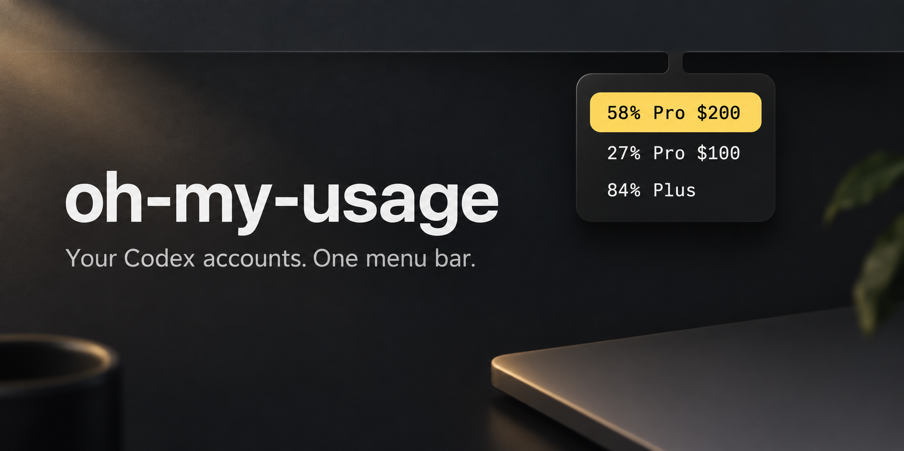
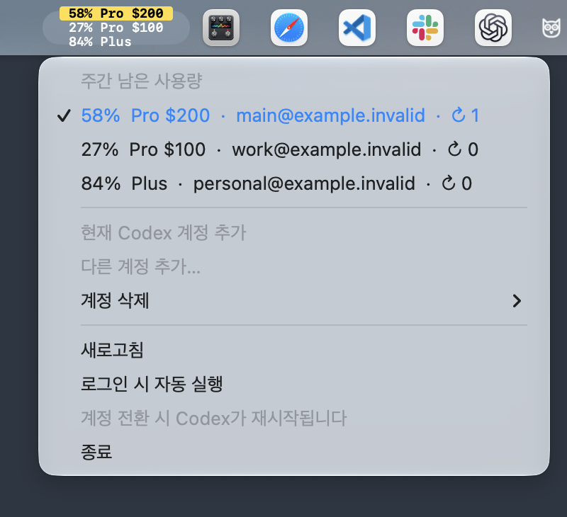

# Oh My Usage

**Codex 계정 여러 개, 메뉴바 하나.** 주간 잔여량을 확인하고 클릭으로 계정을 바꾸는 작은 macOS 앱입니다.



<sub>가상 사용량으로 만든 소개 이미지입니다. 실제 앱은 macOS 메뉴바와 기본 메뉴로 동작합니다.</sub>

[DMG 다운로드](https://github.com/jeonghyeon-net/oh-my-usage/releases/latest) · [사용법](docs/user-guide.md) · [기여하기](CONTRIBUTING.md) · [변경 기록](CHANGELOG.md)

## 실제 화면



<sub>macOS에서 캡처한 앱 화면입니다. 계정과 사용량은 예시 데이터입니다.</sub>

## 하는 일

- 최대 **3개 계정의 주간 남은 사용량**을 세로로 표시합니다.
- 메인 계정은 **노란색**, 요금제는 `Pro $100`, `Pro $200`, `Plus`처럼 구분합니다.
- 클릭하거나 우클릭하면 macOS 기본 메뉴가 열립니다. 여기서 계정을 추가·삭제·전환합니다.
- 남은 초기화권은 메뉴에만 `↻ 1`처럼 표시합니다.
- 60초마다 갱신하며, **로그인 시 자동 실행**을 켤 수 있습니다.

Swift + AppKit. 외부 패키지, 별도 서버, 대시보드 없이 동작합니다. OpenAI의 공식 앱이 아닌 독립적인 오픈소스 도구입니다.

## 시작하기

**Apple Silicon · macOS 14 이상 · 설치된 Codex 앱 · ChatGPT 파일 기반 로그인**이 필요합니다.

1. [최신 릴리스](https://github.com/jeonghyeon-net/oh-my-usage/releases/latest)에서 `arm64.dmg` 파일을 받습니다.
2. DMG를 열고 앱을 **Applications** 폴더로 드래그합니다.
3. 앱을 실행한 뒤 메뉴에서 **현재 Codex 계정 추가** 또는 **다른 계정 추가…**를 선택합니다.

계정 행을 클릭하면 그 계정으로 전환합니다. 전환 시 Codex 앱이 정상 종료 후 다시 열리므로 **진행 중인 작업을 마친 뒤 전환하세요.** Codex가 종료되지 않으면 전환하지 않습니다. 같은 인증 파일을 사용하는 CLI에도 변경이 적용됩니다.

현재 릴리스는 **ad-hoc 서명**이며 Developer ID 서명·Apple 공증은 하지 않습니다. macOS에서 실행을 차단하면 출처를 확인한 뒤 시스템 설정 → 개인정보 보호 및 보안에서 해당 앱의 **확인 없이 열기**를 사용하세요. 시스템 전체의 보안 설정을 끌 필요는 없습니다.

## 계정 정보는 어디에 저장되나요?

`~/Library/Application Support/oh-my-usage/`에 계정 목록과 로그인을 저장합니다. 인증 토큰은 **암호화되지 않은 로컬 파일**이며 파일 권한 `0600`, 생성하는 폴더 권한 `0700`을 사용합니다. Keychain에 저장하지 않습니다. DMG에는 계정 정보가 포함되지 않습니다.

사용량과 로그인은 설치된 공식 Codex CLI를 통해 OpenAI와 통신합니다. 이 프로젝트가 운영하는 서버나 별도 분석 서비스는 없습니다. 계정 삭제는 이 앱의 저장 정보만 제거하며, 구독 취소나 Codex 로그아웃은 아닙니다. [데이터와 삭제](docs/user-guide.md#storage) · [보안 정책](SECURITY.md)

## 지원 범위

`Free`, `Go`, `Plus`, `Pro $100`, `Pro $200`, `Business`, `Enterprise`, `Edu`를 표시합니다. Pro 금액은 요금제 식별을 위한 미국 달러 기준 표기이며 실제 청구 금액을 조회하지 않습니다. 서버가 주간 한도나 초기화권 정보를 제공하지 않으면 `—`로 표시합니다.

Intel Mac, API 키 로그인, Keychain 전용 인증, 사용자 지정 `CODEX_HOME`은 지원하지 않습니다. 메뉴바 높이는 macOS가 정하므로 화면에 따라 3줄 글씨 크기가 달라집니다. [호환성과 제한](docs/user-guide.md#compatibility)을 참고하세요.

## 소스에서 빌드

Xcode Command Line Tools가 필요합니다. 외부 패키지를 설치하지 않습니다.

```sh
git clone https://github.com/jeonghyeon-net/oh-my-usage.git
cd oh-my-usage
make build
open build/oh-my-usage.app
```

```sh
make check    # 가짜 데이터 테스트, 빌드, 로컬 검사
make package  # build/ 아래 DMG와 SHA-256 체크섬 생성
```

검사에는 실제 계정이나 네트워크를 사용하지 않습니다. **CI와 GitHub Actions는 구성하지 않습니다.**

[기여 안내](CONTRIBUTING.md) · [코드 구조](docs/architecture.md) · [수동 배포](docs/releasing.md) · [이미지와 생성 프롬프트](docs/assets/README.md)

저장소 구성은 [Menu Bar Dock](https://github.com/jeonghyeon-net/menubar-dock)을 참고했습니다. [MIT License](LICENSE).
